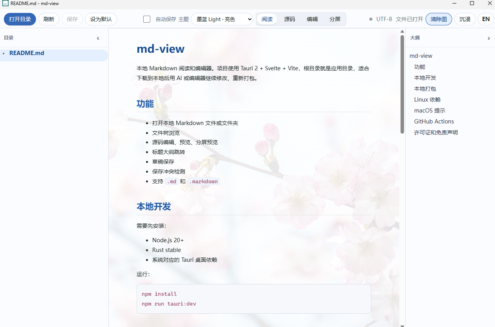

# md-view

[English](README.en.md)

md-view 是一个本地 Markdown 阅读和编辑器，使用 Tauri 2 + Svelte + Vite 构建。它面向需要轻量、本地、可继续自行修改的 Markdown 工具用户。

## 项目特点

- 轻量化：Windows 安装包约 1.3 MB，Windows exe 约 2.9 MB，内存占用低于 5 MB。
- 软件体积小：适合直接下载、打包、复制和本地使用。
- 大纲目录：自动提取标题，支持快速跳转。
- 多种视图：支持阅读、源码编辑、可视化编辑和分屏预览。
- 外观美化：内置多套主题，支持给阅读区设置背景图。
- 本地优先：打开本地 `.md` / `.markdown` 文件或目录，不依赖云服务。



## 功能

- 打开本地 Markdown 文件或文件夹
- 文件树浏览
- 源码编辑、阅读预览、可视化编辑、分屏预览
- 标题大纲跳转
- 草稿保存
- 保存冲突检测
- 支持 `.md` 和 `.markdown`
- 支持主题切换和阅读区背景图
- 支持 Windows 默认应用设置入口

## 本地开发

需要先安装：

- Node.js 20+
- Rust stable
- 系统对应的 Tauri 桌面依赖

运行：

```bash
npm install
npm run tauri:dev
```

## 本地打包

```bash
npm install
npm run tauri:build
```

打包产物在：

```text
src-tauri/target/release/bundle/
```

当前配置会生成当前系统支持的包：

- Windows: NSIS installer
- macOS: DMG
- Linux: AppImage, DEB, RPM

Windows 本地默认使用 NSIS，避免 `all` 目标额外下载 WiX。需要尝试当前系统全部 bundle 目标时运行：

```bash
npm run tauri:build:all
```

## Linux 依赖

Ubuntu/Debian 通常需要先安装：

```bash
sudo apt-get update
sudo apt-get install -y build-essential curl wget file libwebkit2gtk-4.1-dev libxdo-dev libssl-dev libayatana-appindicator3-dev librsvg2-dev patchelf rpm
```

其他发行版按 Tauri 2 的 Linux 依赖安装对应包。

## macOS 提示

本项目默认不做 Apple 签名和公证。朋友之间直接打包分发时，macOS 可能会因为 Gatekeeper 拦截未签名应用。正式公开分发前再补开发者证书、签名和公证流程。

## GitHub Actions

仓库包含 `.github/workflows/build.yml`：

- push 到 `main` / `master` 时构建全平台
- pull request 到 `main` / `master` 时运行构建检查
- 手动运行 workflow 时构建全平台
- 推送 `v*` tag 时会创建草稿 Release 并上传构建产物

示例：

```bash
git tag v0.1.0
git push origin v0.1.0
```

## 贡献说明

本项目不接受 PR。你可以 fork 本仓库，然后使用 AI agent 或本地编辑器按自己的需求修改、打包和分发。

## 许可证和免责声明

许可证使用 WTFPL v2。简单说：想怎么用就怎么用。

免责声明：本项目按原样提供，不提供任何明示或暗示担保。作者不保证它适合任何特定用途，也不对使用、修改、打包、分发或运行本项目造成的任何问题、损失或责任负责。使用者自行承担全部风险。
